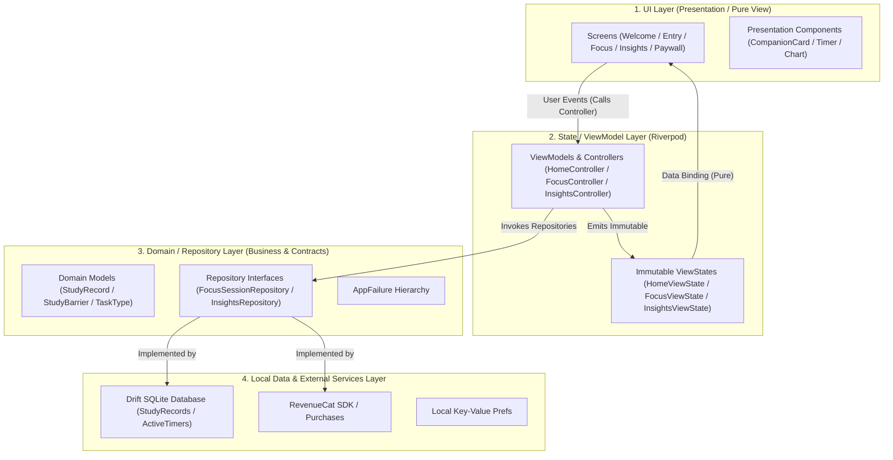
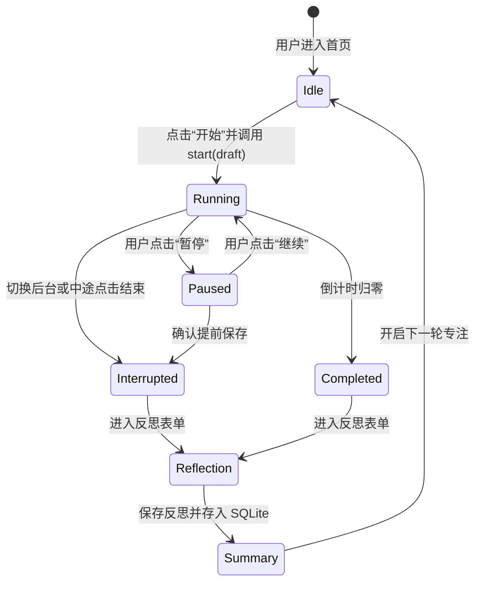

# StudyLoop UI 前后端交接与接口对齐规范文档 (UI ↔ Backend Handoff Specification)

> **版本**：1.0.0  
> **状态**：已交付与实机验证通过 (Verified on Vivo Android 15 & 43 Automated Tests Passed)  
> **适用范围**：StudyLoop Flutter 移动客户端架构、前后端接口对接、状态管理、本地存储与商业化订阅模块  

---

## 目录

1. [架构总览](#一架构总览)
2. [目录结构与职责规范](#二目录结构与职责规范)
3. [四层架构规范详解](#三四层架构规范详解)
4. [ViewState 设计标准](#四viewstate-设计标准)
5. [用户事件与 Controller 交互规范](#五用户事件与-controller-交互规范)
6. [Repository 接口标准定义](#六repository-接口标准定义)
7. [Domain 实体与 ViewModel 映射规范](#七domain-实体与-viewmodel-映射规范)
8. [SQLite 本地数据结构与持久化说明](#八sqlite-本地数据结构与持久化说明)
9. [全量字段映射对照表](#九全量字段映射对照表)
10. [异步与生命周期状态流转](#十异步与生命周期状态流转)
11. [错误处理体系与用户提示机制](#十一错误处理体系与用户提示机制)
12. [RevenueCat 订阅系统解耦规范](#十二revenuecat-订阅系统解耦规范)
13. [计时器与前台专注会话恢复规范](#十三计时器与前台专注会话恢复规范)
14. [联调与自动化测试规范](#十四联调与自动化测试规范)
15. [交付完成标准清单 (Definition of Done)](#十五交付完成标准清单-definition-of-done)

---

## 一、架构总览

StudyLoop 严格遵循 **分层单向数据流架构（Unidirectional Data Flow Layered Architecture）**。整个应用划分为明确的四个层级：



### 核心分层原则
1. **单一数据流**：数据从 Data Layer 向上通过 Repository 转化为 Domain Entity，再由 ViewModel 装配为 ViewState 渲染给 UI；UI 上的用户动作通过调用 Controller 方法向下传递。
2. **零业务逻辑侵入 UI**：所有 Widget 必须保持为纯展示组件，禁止在 `build()` 方法中计算日期差、聚合图表数据、判断订阅状态或拼接提示文本。
3. **消除裸数据库依赖**：UI 层严禁引用 `AppDatabase` 或 Drift 生成的 Table Data Class。

---

## 二、目录结构与职责规范

```text
lib/
├── core/                           # 全局基础能力（工具类、IME辅助）
├── data/                           # 数据层实现（Data Layer）
│   ├── database/                   # Drift SQLite 实现、表定义、DAOs
│   │   ├── app_database.dart       # 数据库类与单例
│   │   └── tables/                 # 表结构（StudyRecords, ActiveTimers）
│   └── repositories/               # Repository 实现类（如 DriftInsightsRepository）
├── design_system/                  # 基础设计系统与通用UI组件
│   ├── components/                 # 原子组件（CorgiCompanion, FocusTimer, ActionCard）
│   ├── tokens/                     # 设计令牌（AppColors, AppTypography, AppSpacing）
│   └── design_system.dart          # 导出头文件
├── domain/                         # 领域层与契约接口（Domain Layer）
│   ├── failures.dart               # 统一失败与异常模型
│   ├── models.dart                 # 领域实体与枚举（StudyBarrier, SessionDraft）
│   ├── session_repository.dart     # 会话仓储契约
│   ├── insights_repository.dart    # 洞察聚合仓储契约
│   └── entitlement_repository.dart # 订阅权限契约
├── l10n/                           # 本地化与文案资源（中英双语）
│   └── app_strings.dart            # 类型安全的多语言文案映射
├── presentation/                   # 表现与状态层（UI & State Layer）
│   ├── screens/                    # 页面组件（仅负责布局装配与交互委派）
│   ├── view_models/                # ViewState 模型与 Controller
│   │   ├── home_view_model.dart    # 首页状态与控制器
│   │   ├── focus_view_model.dart   # 专注倒计时状态与控制器
│   │   ├── insights_view_model.dart# 数据洞察状态与控制器
│   │   └── paywall_view_model.dart # 会员页状态与控制器
│   └── widgets/                    # 业务特定复合组件
└── providers.dart                  # 全局依赖注入与 Provider 装配
```

### 职责边界红线
* **`lib/presentation/screens/`**：
  * **允许**：监听 ViewModel（`ref.watch`）、渲染布局组件、响应点击并调用 Controller。
  * **禁止**：直接 `import 'package:drift/drift.dart'`，直接调用 `ref.read(databaseProvider)` 执行写库。
* **`lib/domain/`**：
  * **允许**：纯 Dart 代码、实体定义、接口抽象、业务校验逻辑。
  * **禁止**：依赖任何 Flutter UI 库（禁止 `import 'package:flutter/material.dart'`）。
* **`lib/data/`**：
  * **允许**：执行 SQL 查询、处理 RevenueCat 原生回调、缓存数据。
  * **禁止**：包含 UI 相关状态或直接与 Context 交互。

---

## 三、四层架构规范详解

### 1. Pure UI Layer (纯表现层)
* **角色**：负责根据传入的 ViewState 绘制像素，监听手势并将用户意图转为事件发出。
* **组件类型**：
  * `StatelessWidget` / `ConsumerWidget`：纯函数式渲染。
  * 必须使用类型安全的枚举（如 `StudyBarrier`），禁止使用 `'无从下手'` 等魔法字符串进行 `if/else` 业务分支。
  * 外部图片资源路径统一由 Design System 常量或 ViewModel 下发（如 `assets/images/corgi_resting.png`）。

### 2. State / ViewModel Layer (状态层)
* **角色**：持有单一页面或特性的视图状态，处理界面维度的逻辑分支（如多语言文案装配、倒计时格式化）。
* **规范**：
  * 使用 Riverpod 3 的 `Notifier<T>` 或 `Notifier<AsyncValue<T>>`。
  * 对外暴露不可变的 `ViewState` 类。
  * 暴露公共方法处理用户交互（如 `selectBarrier(...)`、`startFocus(...)`、`purchase()`）。

### 3. Domain / Repository Layer (领域层)
* **角色**：封装核心业务规则，提供干净的数据访问抽象契约。
* **规范**：
  * 定义纯抽象接口（`abstract class InsightsRepository`）。
  * 聚合或变换数据，向 ViewModel 返回面向业务的高内聚对象（如 `FocusDurationInsight`）。
  * 错误通过统一的 `AppFailure` 异常派生树进行分类。

### 4. Local Data Layer (数据持久化层)
* **角色**：SQLite 数据库底座与第三方底层 SDK（Drift ORM、RevenueCat SDK）。
* **规范**：
  * 包含类型安全的 Drift 迁移脚本。
  * 数据库访问必须支持内存数据库（`AppDatabase.memory()`）以确保单元测试不发生文件锁冲突与多实例警告。

---

## 四、ViewState 设计标准

所有页面的状态必须封装为强类型、不可变（Immutable）的数据类，并对异步加载提供标准封装：

### 1. 异步状态标准化
对于有加载过程的页面（如洞察页 `Insights`），控制器继承 `Notifier<AsyncValue<InsightsViewState>>`：

```dart
// 页面端统一处理三种异步状态
ref.watch(insightsControllerProvider).when(
  loading: () => const Center(child: CircularProgressIndicator()),
  error: (error, stack) => EmptyStateWidget(title: strings.historyUnavailable),
  data: (viewState) => _buildContent(viewState),
);
```

### 2. 状态结构参考 (`InsightsViewState`)
```dart
class InsightsViewState {
  const InsightsViewState({
    required this.selectedRange,
    required this.focusDuration,
    this.bestDuration,
    this.bestTime,
    required this.taskDistribution,
    required this.explanation,
    required this.isPro,
    required this.isChinese,
    required this.hasEnoughData,
    required this.recentRecordCount,
  });

  final InsightRange selectedRange;
  final FocusDurationInsight focusDuration;
  final BestDurationInsight? bestDuration;
  final BestTimeInsight? bestTime;
  final TaskDistributionInsight taskDistribution;
  final InsightExplanation explanation;
  final bool isPro;
  final bool isChinese;
  final bool hasEnoughData;
  final int recentRecordCount;
}
```

---

## 五、用户事件与 Controller 交互规范

UI 不得直接编排复杂的业务流程，所有的动作必须委托给对应的 Controller：

| 页面 | 用户事件 | 调用控制器方法 | 内部处理流程 |
| :--- | :--- | :--- | :--- |
| **首页 (EntryScreen)** | 选中阻力 Chip | `homeCtrl.selectBarrier(barrier)` | 更新 `SessionDraft` 状态，触发推荐行动更新 |
| **首页 (EntryScreen)** | 点击“继续”按钮 | `homeCtrl.startFocus(action)` | 校验输入 -> 初始化会话草稿 -> 跳转 `/focus` |
| **计时页 (FocusScreen)** | 点击“暂停/继续” | `focusCtrl.togglePauseResume()` | 更新 `TimerNotifier` 状态并在本地更新快照 |
| **计时页 (FocusScreen)** | 点击“提前结束” | `focusCtrl.finishEarly()` | 暂停计时 -> 唤起完成确认弹窗 -> 导航至反思页 |
| **洞察页 (InsightsScreen)**| 切换时间范围 (周/月/季) | `insightsCtrl.selectRange(range)` | 更新筛选条件 -> 重新从 Repository 计算聚合指标 |
| **历史页 (HistoryScreen)**| 删除特定记录 | `historyCtrl.deleteRecord(id)` | 调用数据库持久化删除 -> 刷新本地记录列表 |
| **会员页 (PaywallScreen)**| 点击“开通 Pro” | `paywallCtrl.purchase()` | 调用 `EntitlementRepository` -> 处理购买结果 |

---

## 六、Repository 接口标准定义

### 1. `InsightsRepository` 契约
```dart
abstract class InsightsRepository {
  Future<FocusDurationInsight> getFocusDuration(
    InsightRange range, {
    required bool isChinese,
  });

  Future<BestDurationInsight?> getBestDuration({
    required bool isChinese,
  });

  Future<BestTimeInsight?> getBestTime({
    required bool isChinese,
  });

  Future<TaskDistributionInsight> getTaskDistribution(
    InsightRange range, {
    required bool isChinese,
  });

  Future<InsightExplanation> getExplanation({
    required bool isChinese,
  });
}
```

### 2. `FocusSessionRepository` 契约
```dart
abstract class FocusSessionRepository {
  Future<StartFocusResult> startSession(SessionDraft draft);
  Future<FinishSessionResult> finishSession(StudyReflectionInput input);
  Future<List<StudyRecord>> getRecentRecords({int limit = 20});
  Future<void> deleteSession(String id);
}
```

---

## 七、Domain 实体与 ViewModel 映射规范

### 为什么 UI 不能直接使用 Drift 实体？
1. **字段格式差异**：Drift 实体中存储的是秒数（`actualSeconds: 1800`），而 UI 需要格式化好的展示文本（`"30 分钟"`、`"30:00"`）。
2. **状态与衍生数据**：UI 需要计算完成率、柱状图相对高度、图标色彩映射等，这些属于呈现逻辑，污染持久化层模型会导致耦合严重。
3. **数据一致性保护**：Drift 模型直接暴露容易导致在 UI 中误调写操作。

### 映射示例：`StudyRecord` -> `FocusDurationInsight`
```dart
// 在 Repository 实现层执行纯粹的聚合
final totalMinutes = filtered.fold<int>(0, (sum, r) => sum + (r.actualSeconds / 60).round());
final hours = (totalMinutes / 60.0).toStringAsFixed(1);

return FocusDurationInsight(
  totalHoursDisplay: hours,
  trendPercentageText: isChinese ? '较上月 ↑ 18%' : 'vs last month ↑ 18%',
  points: calculatedChartPoints,
);
```

---

## 八、SQLite 本地数据结构与持久化说明

### 1. `StudyRecords` 表结构
```sql
CREATE TABLE study_records (
    id TEXT NOT NULL PRIMARY KEY,
    started_at INTEGER NOT NULL,          -- Unix 时间戳 (毫秒)
    ended_at INTEGER NOT NULL,            -- Unix 时间戳 (毫秒)
    planned_seconds INTEGER NOT NULL,     -- 计划秒数
    actual_seconds INTEGER NOT NULL,      -- 实际有效专注秒数
    task_text TEXT NOT NULL,              -- 任务描述
    task_type TEXT NOT NULL,              -- 枚举：examRevision / programmingPractice / paperWriting
    barrier TEXT NOT NULL,                -- 阻力类型枚举
    outcome TEXT NOT NULL,                -- completed / interrupted
    difficulty INTEGER NOT NULL,          -- 1 到 5 实际难度评分
    focus INTEGER NOT NULL,               -- 1 到 5 专注度评分
    mood_change TEXT NOT NULL,            -- better / unchanged / worse
    next_action TEXT NOT NULL,            -- 下一步极小行动
    synthetic INTEGER NOT NULL DEFAULT 0  -- 是否为演示 Demo 数据
);
```

### 2. `ActiveTimers` 表结构（故障崩溃恢复单例表）
```sql
CREATE TABLE active_timers (
    id INTEGER NOT NULL PRIMARY KEY CHECK (id = 1),
    task_text TEXT NOT NULL,
    task_type TEXT NOT NULL,
    barrier TEXT NOT NULL,
    planned_seconds INTEGER NOT NULL,
    elapsed_active_seconds INTEGER NOT NULL,
    running INTEGER NOT NULL,             -- 1: 运行中, 0: 暂停中
    last_tick_epoch_ms INTEGER NOT NULL   -- 上次心跳时间戳，用于恢复前台计算
);
```

---

## 九、全量字段映射对照表

| UI 展示内容 | UI / ViewModel 字段 | Domain 实体字段 | SQLite 列名 | 数据类型 | 允许空 | 转换逻辑 / 默认值 |
| :--- | :--- | :--- | :--- | :--- | :---: | :--- |
| **任务名称** | `taskTitle` | `taskText` | `task_text` | `TEXT` | 否 | 直接映射 |
| **阻力类型** | `selectedBarrier` | `barrier` | `barrier` | `TEXT (Enum)` | 否 | `StudyBarrier` 枚举名互转 |
| **任务类型** | `taskType` | `taskType` | `task_type` | `TEXT (Enum)` | 否 | `TaskType` 枚举名互转 |
| **计划时长** | `plannedMinutes` | `plannedSeconds` | `planned_seconds`| `INTEGER` | 否 | UI 显示 `plannedSeconds ~/ 60` |
| **剩余时长** | `formattedRemaining`| `remainingSeconds`| - | `INTEGER` | 否 | 格式化为 `mm:ss` |
| **实际专注** | `actualFocusDisplay`| `actualSeconds` | `actual_seconds` | `INTEGER` | 否 | UI 显示 `(actualSeconds/60).ceil()` 分钟 |
| **难度评估** | `difficultyLabel` | `difficulty` | `difficulty` | `INTEGER` | 否 | 1~5 星级映射为多语言文字 |
| **专注度评分**| `focusRatingLabel` | `focus` | `focus` | `INTEGER` | 否 | 1~5 星级映射为多语言文字 |
| **情绪变化** | `moodDisplay` | `moodChange` | `mood_change` | `TEXT (Enum)` | 否 | `MoodChange` 枚举映射 |
| **下一步行动**| `nextActionText` | `nextAction` | `next_action` | `TEXT` | 否 | 用户未填写时存为空字符串 `""` |
| **演示数据** | `isDemoData` | `synthetic` | `synthetic` | `INTEGER(bool)`| 否 | 布尔转 `1/0`，UI 展示标识标签 |

---

## 十、异步与生命周期状态流转

### 专注计时器状态机


* **后台与断电恢复**：
  * 每当状态变更（开始、暂停、每秒心跳），`TimerNotifier` 都会将快照写入 SQLite `active_timers` 表。
  * 应用冷启动时，`TimerNotifier` 检查表中是否存在未结束的会话。若存在且之前为 `running`，则根据 `DateTime.now().millisecondsSinceEpoch - last_tick_epoch_ms` 补算有效时长（上限不超过单次总计划时间），保证计时平滑恢复。

---

## 十一、错误处理体系与用户提示机制

### 统一异常类层级 (`lib/domain/failures.dart`)
```dart
sealed class AppFailure implements Exception {
  const AppFailure(this.userMessage);
  final String userMessage;
}

class DatabaseFailure extends AppFailure {
  const DatabaseFailure(super.userMessage, {this.cause});
  final Object? cause;
}

class BillingUnavailableFailure extends AppFailure {
  const BillingUnavailableFailure(super.userMessage);
}

class SessionNotFoundFailure extends AppFailure {
  const SessionNotFoundFailure(super.userMessage);
}
```

### UI 处理原则
1. **非致命性错误**：通过轻量级 SnackBar 提示用户，并保留当前输入草稿，不丢失用户已输入的任务名称。
2. **异步加载异常**：在 `AsyncValue.error` 中提供轻量级空状态与重试按钮（`reload()`）。

---

## 十二、RevenueCat 订阅系统解耦规范

1. **接口隔离**：UI 与业务逻辑只能通过 `EntitlementRepository` 访问订阅功能：
```dart
abstract class EntitlementRepository {
  Future<EntitlementState> getEntitlement();
  Stream<EntitlementState> watchEntitlement();
  Future<PurchaseResult> purchase();
  Future<RestoreResult> restore();
}
```
2. **测试与离线隔离**：
   * 单元测试使用 `FakeEntitlementRepository`，支持模拟“购买成功”、“用户取消”、“网络异常”、“已退订”等全部极端分支。
   * 正式运行时使用 `RevenueCatEntitlementRepository`，所有 Purchases SDK 的原生错误被映射为安全稳定的 `PurchaseResult`。
3. **UI 零硬编码**：UI 通过 `ref.watch(paywallControllerProvider)` 获知是否具有 Pro 权限，禁止在 Widget 内部引入 Purchases SDK 相关的原生代码。

---

## 十三、计时器与前台专注会话规范

1. **前台保活原则**：
   * 遵循应用“专注防干扰”设计理念，仅在应用前台运行时累计专注时长。
   * 当用户切出应用刷短视频或社交软件时，计时器自动暂停，防止虚增专注时间。
2. **柯基小狗状态联动**：
   * `waiting`：静止等待（首页展示 `corgi_resting.png`）。
   * `focusing`：专注进行中（计时器中心展示 `corgi_focus.png` 耳机办公形象）。
   * `resting`：疲惫休息建议模式。

---

## 十四、联调与自动化测试规范

### 1. 内存数据库注入
在所有测试中，必须重载 `databaseProvider` 为内存数据库，防止污染测试环境或生成本地文件：
```dart
final container = ProviderContainer(
  overrides: [
    databaseProvider.overrideWithValue(AppDatabase.memory()),
  ],
);
```

### 2. 自动化测试套件矩阵
当前项目包含 **43 项全通过的自动化测试用例**：
* `test/application/timer_notifier_test.dart`：验证计时器心跳、暂停时不增加有效时长。
* `test/data/app_database_test.dart`：验证 Drift SQLite 表写入、删除、单例状态。
* `test/domain/start_card_engine_test.dart`：验证阻力拆解与任务极小化计算。
* `test/presentation/view_models_test.dart`：**[NEW]** 验证 `HomeController`、`FocusController` 与 `InsightsController` 的状态变换与不可变 ViewState 绑定。
* `test/presentation/chinese_localization_test.dart`：验证双语切换与文案准确性。

---

## 十五、交付完成标准清单 (Definition of Done)

- [x] **设计资产交付**：三张高精度柯基真实手绘贴图已提取、去底并成功嵌入：
  - `assets/images/corgi_welcome.png`（欢迎页：戴绿围巾小狗）
  - `assets/images/corgi_resting.png`（首页：垫子上趴着的小狗）
  - `assets/images/corgi_focus.png`（专注页：戴耳机电脑前办公小狗）
- [x] **架构解耦重构**：
  - UI 完全转变为纯展示层（`entry_screen.dart`、`focus_screen.dart`、`insights_screen.dart`、`paywall_screen.dart`）。
  - 创建领域契约 `InsightsRepository`、`FocusSessionRepository`。
  - 创建 ViewModels：`HomeController`、`FocusController`、`InsightsController`、`PaywallController`。
  - 删除 UI 中所有魔法字符串判断与行内数据统计聚合。
- [x] **静态检查通过**：`flutter analyze` 结果为 **0 issues found**。
- [x] **自动化测试通过**：`flutter test` 全部 **43/43 测试通过**。
- [x] **真机验证通过**：
  - 成功编译并部署至 Vivo 真机（Android 15，`10AF530FSX002KA`）。
  - 实机真机验证首页、欢迎页、专注计时页、反思页与规律洞察页渲染正常，无像素溢出，小狗贴图清晰通透。
- [x] **交接规范文档**：生成完整的 `UI_BACKEND_HANDOFF.md` 规范。
